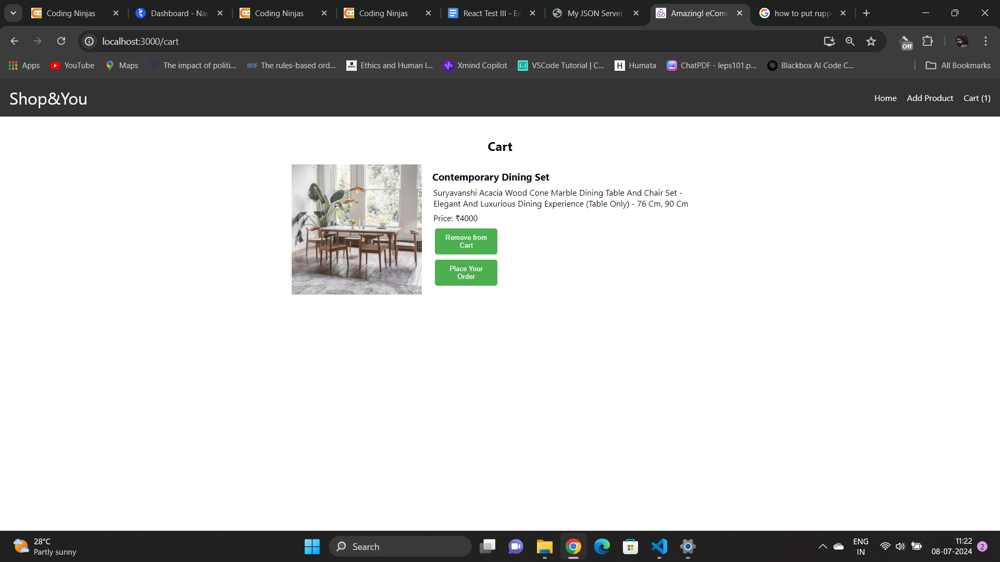
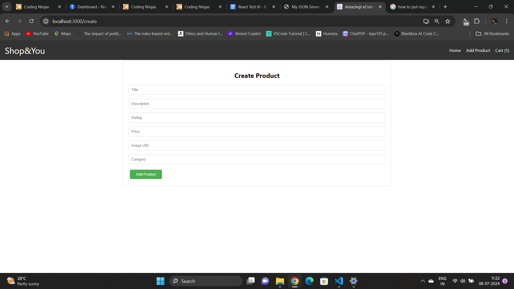
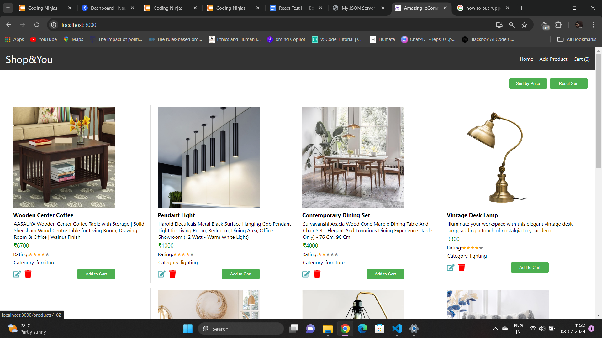

# Ecommerce-React-Redux

This project is an eCommerce web application built using React and Redux. It allows users to browse products, add them to the cart, and proceed with the checkout process. The application is designed to demonstrate the use of React for building user interfaces and Redux for state management.

## Deployment Link

The application is deployed and can be accessed at the following link:

[Deployment Link](https://668b82d2f28330c4244ba892--statuesque-pika-e8c936.netlify.app/)

## Features

- **Navbar**
  - Show cart items count
  - Show relevant navigation links

- **All Products Page**
  - Show list of products from the API
  - Each product is editable inline by clicking on the “pencil” button. On finishing editing, an alert/notification is shown.
  - Each product is deletable by clicking the delete button, with an alert/notification shown upon deletion.
  - Implement a sort button to sort products by “price” and a cross button to remove the sort.
  - Button to add a product to the cart

- **Create Page**
  - On clicking the Add button, the product is added to the database with an alert/notification shown.

- **Product Detail Page**
  - Show all details of a product
  - Button to add the product to the cart

- **Cart Page**
  - Show all items in the cart


## Technologies Used

- **React**: For building the user interface
- **Redux**: For state management
- **React Router**: For routing
- **Redux Thunk**: For handling asynchronous actions
- **Bootstrap**: For styling


## Getting Started

These instructions will help you set up and run the project on your local machine for development and testing purposes.

### Prerequisites

Make sure you have the following software installed:

- Node.js
- npm (Node Package Manager)

### Installation


```bash
# Clone the repository:
git clone https://github.com/aishwaryagorakh/Ecommerce-React-Redux

# Navigate into the project directory:
cd TodoList-App-uinsg-React

# Install dependencies:
npm install
 Start the development server and view the calculator:
npm start

# Open http://localhost:3000 in your web browser to use the calculator.
# Contributions are welcome. If you'd like to contribute to this project:
# - Fork the repository
# - Create a new branch
# - Submit a pull request
```

## Screenshots





